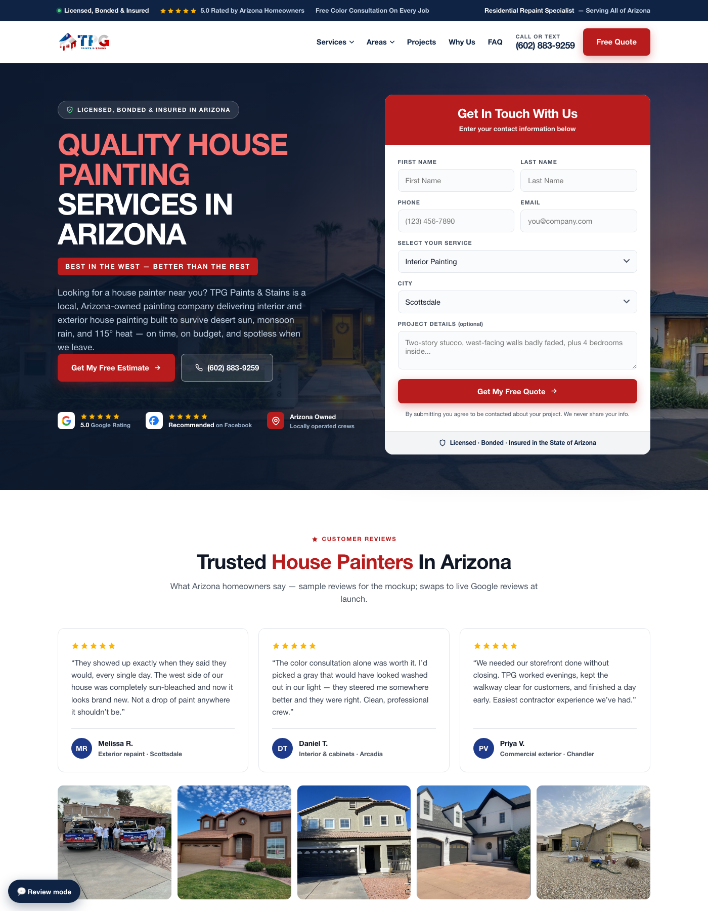
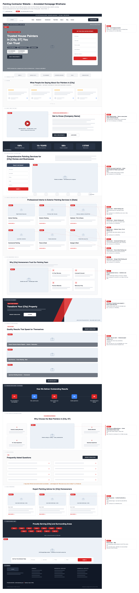

# Instant Website Builder

**Paste one URL → get a pitch-ready 5-page website mockup.**

A system by Paint & Profits for building high-converting mockup websites for local
service businesses (painters, roofers, HVAC, any contractor). It scrapes the
company's real brand — logo, colors, photos, phone, taglines, cities — pulls their
SEO keyword gap, and builds a validated 5-page site on a fixed, proven wireframe.
Runs inside [Claude Code](https://claude.com/claude-code).

<p align="center">
  
  <br><em>Built by the system from one URL: real logo, real photos, real brand colors, SEO-targeted copy.</em>
</p>

## How to use it

Open Claude Code and paste:

```
Build a mockup site for <company-url>
```

That's the whole workflow. Optional extras on the next lines: a folder of photos,
a Semrush PDF path, or notes. Full operator guide: [skill/SOP.md](skill/SOP.md).

## What's in this repo

| Folder | What it is |
|---|---|
| [`skill/`](skill/) | **The engine.** The Claude Code skill that runs every build. Live copy installed at `~/.claude/skills/mockup-site/` — this repo is the backup/source of truth. |
| [`wireframe-handoff/`](wireframe-handoff/) | **The design DNA.** The annotated homepage wireframe (SVG + render), the Photo Direction deck (PDF/PPTX), and `photo_slots.json` — the 16 photo-slot specs every build follows. |
| [`docs/`](docs/) | Screenshots and visual documentation. |
| [`examples/tpg-paints-and-stains/`](examples/tpg-paints-and-stains/) | **The worked example.** Complete 5-page build for TPG Paints & Stains (Arizona painter): home, 3 area pages, exterior-painting service page, real harvested assets. |

## Inside `skill/`

| File | Purpose |
|---|---|
| `SKILL.md` | The playbook Claude follows — intake, 5-stage pipeline, hard rules |
| `SOP.md` | Human operator guide: prep → kickoff → review checklist → delivery |
| `scripts/harvest.py` | **URL scraper.** One command pulls contact info, socials, services, cities, taglines, brand colors, logo, and every real photo into `brief.json` |
| `scripts/keyword_gap_dataforseo.py` | **Keyword gap puller.** DataForSEO API → keywords competitors rank for that the client doesn't (~$0.26/client). Needs `DATAFORSEO_LOGIN`/`PASSWORD` env vars |
| `scripts/pdf_extract.py` | Zero-dependency Semrush PDF text extractor (fallback keyword source) |
| `scripts/validate_site.py` | Pre-delivery validator: nesting, links, assets, anchors |
| `scripts/example_gen_pages.py` | Area/service page generator (TPG worked example — copy + rewrite per client) |
| `templates/home-wireframe.html` | **The master homepage template.** Self-contained build of the wireframe: all 18 sections, labeled photo slots, working forms, mobile layout. Every build starts by copying this |
| `references/` | Wireframe SVG + photo slots (bundled), harvest guide, page anatomy, SEO mapping rules, API integration guide |
| `assets/style.css` | Shared stylesheet for sub-pages |

## The pipeline (what Claude does per build)

1. **Harvest** — `harvest.py` scrapes the site; Claude inspects every photo
   (rejects watermarked/MLS images — copyright), chases gaps via web search
2. **Brand** — colors from their CSS + logo (logo wins), mapped onto the template
3. **SEO** — keyword gap via DataForSEO → Semrush connector → Semrush PDF → generic
   local rules; head terms into titles/H1s, near-me phrasing into copy
4. **Build** — homepage from the wireframe template + 3 area pages (each a genuinely
   different local angle) + 1 flagship service page
5. **QA + deliver** — validator must pass, served on localhost, screenshot proof

## Hard rules (why the mockups are safe to pitch)

- Never ship watermarked or third-party photos (MLS/stock = copyright liability)
- Never invent dollar prices — scope tiers only, labeled illustrative
- Fabricated content stays labeled (sample reviews note, "— Design mockup." footer)
- Real contact info everywhere — their actual phone, email, cities
- Missing photos get honest labeled placeholders, never stock

## Costs

| Thing | Cost |
|---|---|
| Build a mockup | Claude usage only |
| Keyword gap (DataForSEO) | ~$0.26 per client (pay-as-you-go, $50 min deposit) |
| Keyword gap (fallback) | Free — manual Semrush PDF export |

## The wireframe

Every homepage follows this exact 18-section structure (annotated; hatched boxes =
photo slots matched to the Photo Direction deck):

<p align="center">
  
</p>

---

*Wireframe v1 synthesized from the Legacy Painting and Pro Vision Painting drafts.*
*© Paint & Profits. All rights reserved.*
